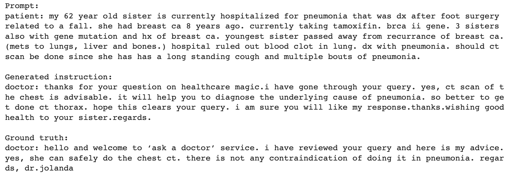

## Project: Fine-tune Llama2 for medical consultancy

### Overview
This project aims to fine-tune `Llama2` to produce a medical consultant chatbot.

Disclaimer: The main objective of this project is on the data science (e.g., fine-tuning an LLM) and not on the medical aspect.

### Model
[Llama2](https://ai.meta.com/llama/)

### Dataset
HuggingFace-hosted [medical_dialog](https://huggingface.co/datasets/medical_dialog) dataset

### Sample Result

